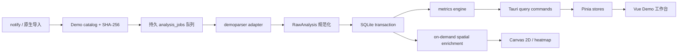

# CS2 Demo 完整平台：demoparser + cs-demo-manager 上游复用实施交接（2026-07-30）

> **续作覆盖说明（2026-07-31）**：本文件记录初始全量方案；实际执行已完成其中的上游固定、SQLite v5、adapter 3、基础 library/overview/scoreboard/rounds。后续 AI 必须优先执行 [续作方案](E:\CS2AS05\docs\demo-platform-completion-execution-plan-20260731.md)。视觉方向以续作方案为准：使用 UI/UX Pro Max 通用蓝色 SaaS Data-Dense Dashboard 模板。

> 本文给下一位“实际执行 AI”使用。本文是独立上下文：先读完，再改代码。不要依赖本次对话、旧 AI 的口头结论或未记录的本机状态。

## 0. 一句话决策

保留本项目 Tauri 2 + Rust + SQLite + Vue 3 技术栈，以 `LaihoE/demoparser` 为唯一 Demo 字节解析内核，直接复用 `akiver/cs-demo-manager` 的 MIT 雷达资源、地图坐标元数据、坐标变换、领域模型字段、分析队列状态机和成熟的信息架构；不再手写第二套协议解析器，不嵌入 Electron，不引入 PostgreSQL，也不把两个解析内核并行运行。

最终产品不是当前“一个表格加折叠时间线”的增量美化，而是本地优先的完整 Demo 工作台：录像库、可靠后台分析、比赛总览、完整记分板、回合、经济、首杀与对枪、道具、玩家详情、2D 回放、热力图、搜索筛选、导出、错误恢复和真实 CS2 自动录像闭环都必须连通。

## 1. 当前权威基线

执行前重新运行并保存结果，禁止假设工作树仍与本文一致：

```powershell
Set-Location E:\CS2AS05
git status --short
git rev-parse HEAD
git log -1 --format='%H%n%aI%n%s'
git diff --stat
git submodule status
```

本文调查时的本地状态：

- 应用版本 `0.5.5`，根仓库 HEAD 为 `8552b554993fec66866d2133d315342be3e0cbca`。
- `git status --short` 为空；实际执行时若出现用户改动，必须保留并与之协作，禁止 reset/restore/clean。
- 技术栈：Tauri `2.10.3`、Vue `3.5.31`、Pinia `3.0.4`、Rust `1.77.2`、`rusqlite 0.32`、`notify 7.0`。
- `src-tauri/Cargo.toml` 已用 path dependency 编译 `third_party/demoparser/parser`。
- `third_party/demoparser` 只是父仓库内的 vendored 目录，不是独立 Git 仓库；不要在该目录执行 `git pull` 并误以为更新了上游。
- 现有数据库为 `%APPDATA%/com.aipc.cs2botimprover/demo-review/demo-review-v1.sqlite3`，`PRAGMA user_version=4`。
- 现有报告 `schemaVersion=4`、`parserAdapterVersion=2`、`metricsVersion=simple-rating-v1`。
- 现有 UI 入口为 `src/views/DemoReviewView.vue`，当前只包含录像库、基础记分板和击杀/炸弹折叠时间线。
- 现有主窗口仅 `960x700`、最小 `720x620`；独立战报窗口 `1100x720`。
- 现有解析在 `src-tauri/src/services/demo.rs` 单文件中，使用 `ForceSingleThreaded`，全文件读入内存，立即同步解析并把整个报告 JSON 塞入 `demo_files.report_json`。
- 现有 watcher 只发 `demo://filesystem-changed`，由前端 1 秒 debounce 后全量扫描；没有持久任务队列、进度、取消、并发限制或崩溃恢复。
- 现有缓存指纹只有 canonical path + size + mtime；没有内容 checksum。
- 已有正确基础必须保留：文件稳定性检查、路径规范化、symlink 跳过、默认 `game\csgo` 根目录、BOT userid 身份合并、controller totals 优先、已知 `IllegalPathOp` 回退、未知值为 `null`/`--`、自动录像 cfg、独立战报窗口。

## 2. 上游调查与固定版本

### 2.1 LaihoE/demoparser

- 仓库：<https://github.com/LaihoE/demoparser>
- 许可证：MIT。
- 2026-07-30 调查到的 `main` HEAD：`ba39cc44cd5abfd7f34df2b3c0a7dd3630048311`，提交时间 `2026-07-07T14:56:00Z`，提交说明 `remove mimalloc`。
- 本项目已有 provenance 声称同一提交。执行 AI 必须做文件清单/哈希核对，不能只看 `PARSER_COMMIT` 字符串。
- 上游能力不是事件回调式 API，而是一次声明 `wanted_events`、`wanted_player_props`、`wanted_other_props`、`wanted_ticks` 后查询 Demo；支持事件、逐 Tick 玩家状态、projectiles、grenades、convars、header、userinfo、voice 等。
- 上游公开基准为 4.6 GB / 50 个 Demo，12 核约 749 MB/s、4 核约 328 MB/s；这是 Linux 上游数据，不得当成本项目 Windows 实测成绩。
- 与本项目直接相关的上游示例：
  - `examples/efficiently_parse_multi_events_and_ticks/`
  - `examples/scoreboard/`
  - `examples/equipment_value_freeze_end/`
  - `examples/round_time/`
  - `examples/util_dmg/`

必须继续以 Rust parser crate 直接编译，不要换成 Python、Node native addon 或 WASM；这些替代会增加运行时、打包和 ABI 风险，且不会提供本项目需要的 Rust 类型安全。

### 2.2 akiver/cs-demo-manager

- 仓库：<https://github.com/akiver/cs-demo-manager>
- 许可证：MIT，版权声明 `Copyright (c) 2014-present AkiVer`。
- 2026-07-30 调查到版本 `3.20.1`，`main` HEAD：`8961f5072fe4d42803dde68e8e71b3c90b216504`，提交时间 `2026-07-30T00:16:47Z`。
- 上游应用是 Electron/React/TypeScript + PostgreSQL；实际分析调用 `@akiver/cs-demo-analyzer 1.10.5` sidecar 生成 CSV，再插入 PostgreSQL。不要照搬这条部署链。
- 上游成熟能力包括：最多 8 个分析任务、pending/analyzing/inserting/success/error 分段状态；比赛/玩家/回合规范化表；完整记分板、回合历史、经济、对枪矩阵、首杀、道具、热力图、2D viewer、聊天、导出、标签和 Demo 播放定位。
- 可直接复用且适合本项目的部分：
  - `static/images/maps/cs2/radars/*.png` 与 `thumbnails/*.png`；
  - `src/node/database/maps/default-maps.ts` 的 CS2 `position_x/position_y/scale/threshold_z`；
  - `src/ui/maps/get-scaled-coordinate-x.ts` 和 `get-scaled-coordinate-y.ts`；
  - `src/common/types/match.ts`、`match-player.ts`、`round.ts` 的字段集合；
  - `src/server/analyses-listener.ts` 的有界队列、状态通知和分析/入库分段语义；
  - match tabs、scoreboard、rounds、economy、duels、grenades、heatmap、viewer-2d 的信息架构和交互模式；
  - ECharts（上游使用 `echarts 6.1.0`）的数据可视化选择。
- 不直接引入：Electron main/renderer server、PostgreSQL/psql、Steam API 账户同步、下载平台、HLAE/FFmpeg 视频制作、VAC 查询、Faceit/5E/Renown 网络账户。这些不是本次本地 Demo 完整性的必要条件。

### 2.3 供应链和归属落地

新增：

```text
third_party/cs-demo-manager/LICENSE
third_party/cs-demo-manager/PROVENANCE.md
third_party/cs-demo-manager/map-manifest.json
src/assets/maps/cs2/radars/*.png
src/assets/maps/cs2/thumbnails/*.png
src/data/cs2-map-metadata.ts
```

`PROVENANCE.md` 必须记录仓库 URL、固定 commit、取得日期、逐项复用路径、下游对应文件、是否原样复制/机械转换/重写。`map-manifest.json` 对每个资产记录 upstream path、下游 path、字节数和 SHA-256。更新根 `NOTICE.md`，保留完整 MIT 文本。不要把整个 cs-demo-manager 仓库复制进来。

对 `third_party/demoparser` 新增可复现清单：

```text
third_party/demoparser/UPSTREAM_COMMIT
third_party/demoparser/SOURCE-MANIFEST.sha256
```

从 GitHub tarball `https://github.com/LaihoE/demoparser/archive/ba39cc44cd5abfd7f34df2b3c0a7dd3630048311.tar.gz` 解包到临时目录，比对实际 vendored parser 文件；只在差异有证据时更新，不要盲覆本地下游补丁。

## 3. 最终用户体验与完成定义

### 3.1 录像库

- 自动发现选中 CS2 根目录的 `game\csgo` 和 `replays`，支持添加/禁用/移除自定义目录。
- 支持 Tauri 原生文件/目录对话框、拖入 `.dem`、Explorer 中显示、重命名显示名、删除索引（默认不删原文件）、显式“同时删除源文件”二次确认。
- 列表支持搜索、地图、时间范围、来源、解析状态、比赛类型、玩家名、标签筛选；列排序、列显隐、分页和多选批量分析/重试/导出。
- 每一行显示地图缩略图、比分、时长、日期、文件大小、玩家数、分析阶段、进度和可操作错误。
- 文件用 SHA-256 checksum 去重；同内容不同路径存一份比赛、多条 `demo_paths`。

### 3.2 比赛工作台

打开比赛后使用单一全宽工作区，顶部是地图/比分/双方/日期/时长/来源/数据质量和操作条，二级标签固定为：

```text
总览 | 记分板 | 回合 | 经济 | 对枪 | 道具 | 地图回放 | 热力图
```

- 总览：比分时间轴、胜负回合、队伍侧别、关键表现、最佳选手、基础质量说明。
- 记分板：玩家、K-D-A、+/-、ADR、KAST、HS%、首杀/首死、交易、道具伤害、MVP、Rating；支持排序、列显隐、玩家展开。
- 回合：回合导航、起止/冻结结束/官方结束 tick、胜方/原因、经济类型、装备价值、击杀流、炸弹和道具事件。
- 经济：双方逐回合装备价值、花费、起始金钱、经济类型与优势差；图旁始终显示可读数值表。
- 对枪：玩家对枪矩阵、首杀对局、1vX/clutch；矩阵可键盘访问并有文本替代。
- 道具：HE 伤害、闪白敌人/队友、燃烧伤害、烟/火/闪/雷投掷列表和地图落点。
- 地图回放：Canvas 2D，回合切换、播放/暂停、倍速、拖动 tick、上下层、玩家朝向/血甲/装备、炸弹、投掷物、击杀提示；不要依赖浏览器下载或新窗口 API。
- 热力图：击杀、死亡、射击、道具事件，按玩家/队伍/回合/阵营/层级筛选；支持 Tauri 原生保存 PNG。
- 事件与聊天：按 tick 检索击杀、伤害、炸弹、道具和聊天，支持复制/导出；默认尊重本地隐私，不联网补全或上传玩家资料。
- 原生观看：从比赛、回合和关键事件用 Rust 校验 Demo 路径后启动 CS2，支持从指定 tick 观看；复用本项目现有 Steam/CS2 启动基础设施，不经 URL scheme 或浏览器 API 猜测路径。

### 3.3 数据诚实性

- 原始缺失值一律 `null`，UI 一律 `--`；禁止用 `0` 伪造解析成功。
- 每个派生字段必须记录 `metricVersion` 和输入完整性。KAST、交易、经济、clutch、Rating 没有足够逐回合输入时只显示 unavailable 原因。
- 保留 `simple-rating-v1` 兼容字段。只有实现经过公开公式和固定向量验证的模型时才能显示 `HLTV Rating 1.0/2.0`；否则统一显示“简易 Rating”，不得冒充官方模型。
- 事件、controller totals 和派生值冲突时，报告要暴露 `dataQuality` 和来源，而不是静默选一个值。

## 4. 目标架构



关键约束：

1. `demoparser` 只负责将 Demo 字节转为原始 header/events/props/ticks；业务指标不能散落在 parser adapter 内。
2. SQLite 是权威状态；前端事件只是刷新提示，不能成为唯一任务状态。
3. 一次 Demo core pass 同时请求核心事件和属性，禁止为每个页面重复整文件解析。
4. 空间数据按需 enrichment：首次 core 分析快速完成；用户打开地图回放/热力图时再做 positions pass，并持久缓存。
5. 查询 API 返回页面所需切片，禁止再次把整场 `report_json` 通过 IPC 发送给 Vue。
6. 所有重 CPU/IO 都在 Tauri `spawn_blocking` 或受控 worker 中，主线程和 WebView 不做文件读取、哈希、CSV/JSON 大导出。

## 5. Rust 模块拆分

把当前 1300 行 `src-tauri/src/services/demo.rs` 拆成以下边界；旧对外命令先保留兼容，完成迁移后再删旧实现：

```text
src-tauri/src/demo/
  mod.rs
  catalog.rs             # roots、paths、扫描、稳定性、checksum
  watcher.rs             # notify debounce、文件稳定、事件去重
  jobs.rs                # 持久队列、worker、进度、取消、恢复
  parser/
    mod.rs
    demoparser_adapter.rs
    requested_fields.rs
    raw_analysis.rs
    identity.rs
  normalize/
    mod.rs
    rounds.rs
    players.rs
    events.rs
    spatial.rs
  metrics/
    mod.rs
    scoreboard.rs
    kast.rs
    trades.rs
    clutches.rs
    economy.rs
    rating.rs
  repository/
    mod.rs
    migrations.rs
    write_analysis.rs
    library_queries.rs
    match_queries.rs
    spatial_queries.rs
  export.rs
src-tauri/src/commands/demo.rs
src-tauri/src/models/demo/
  mod.rs library.rs match.rs round.rs player.rs spatial.rs quality.rs job.rs
```

`services/demo.rs` 最终只允许成为过渡 re-export，或删除并更新 `services/mod.rs`。每个模块应有单元测试；不要再把 SQL、解析、指标、watcher 和 DTO 放回一个文件。

### 5.1 分析队列

参考 cs-demo-manager 的 `AnalysesListener`，实现持久状态：

```text
queued -> fingerprinting -> parsing_core -> normalizing -> persisting
       -> computing_metrics -> done
       -> parsing_spatial -> spatial_done
任一步 -> error / canceled
```

- 启动时把遗留 `running` job 恢复为 `queued`，`attempts+1`，最多自动重试 2 次。
- 默认 core 并发 `max(1, min(2, logical_cpu/2))`，设置允许 1..4；空间 pass 同时最多 1 个。不要照搬上游最大 8，因为本项目解析会占用大量内存。
- 相同 checksum + parser/schema/metric version 只能存在一个 active job。
- 每个 job 保存阶段、0..100 progress、错误码、可读错误、日志尾部、created/started/finished 时间。
- watcher 事件先进入稳定性状态机：250 ms 轮询不够。要求 size + mtime 连续 3 次不变，间隔 750 ms，且 CS2 进程退出或文件至少 3 秒无写入；超时保持 `waiting_for_file`，不标 error。
- `demo://analysis-updated` 只携带 job id/checksum/stage/progress；前端收到后按 id 回读。

### 5.2 demoparser 请求

Core pass 至少请求：

- Events：round_start、round_freeze_end、round_end、round_officially_ended、player_death、player_hurt、weapon_fire、item_purchase、player_blind、smokegrenade_detonate、hegrenade_detonate、flashbang_detonate、inferno_startburn、inferno_expire、bomb_beginplant、bomb_planted、bomb_begindefuse、bomb_defused、bomb_exploded、player_spawn、player_disconnect、player_connect、player_team、round_mvp。
- Player aggregate props：kills/deaths/assists/damage/headshots、score、MVP、utility damage、enemies flashed、equipment value、money saved/spent、team、name、steamid、userid、controller/pawn identity。
- Game props：team scores、total rounds、phase、freeze/warmup、round win status/reason、timeouts、bomb state。
- Header/convars：map、server、client、tick count、tickrate/interval、duration、game mode、date 可用来源。

Spatial pass 只在需要时请求抽样 ticks：X/Y/Z、yaw、health、armor、alive、team、active weapon、inventory、cash、helmet/defuser、flash、bomb carrier；默认 8 ticks/s，关键事件 tick 强制保留。positions 的精度/体积可配置为 4/8/16 ticks/s，数据库记录 sampling rate。

不要为同一 pass 重复调用 parser。先制作 `RequestedFields` 常量和上游真实属性名映射测试；当某属性因 CS2 更新不可用时，降级单字段/功能，不让整场 core 报告失败。只对已证实的 `IllegalPathOp` 使用现有无实体回退，其他错误保留原始根因。

## 6. SQLite v5 规范化迁移

保留数据库文件名，升级到 `PRAGMA user_version=5`。迁移必须单事务、可重复检测；先 checkpoint WAL，再使用 SQLite backup API 或 `VACUUM INTO` 生成同目录带时间戳 `.bak`，禁止在活跃 WAL 下直接复制主 DB 文件。失败回滚并继续用 v4 只读模式展示旧报告。

最低表集：

```text
demo_roots
demos(id, checksum, file_name, size_bytes, mtime_ms, source, status, created_at)
demo_paths(id, demo_id, canonical_path UNIQUE, exists_now, last_seen_at)
analysis_jobs(id, demo_id, kind, stage, progress, attempts, error_code,
              error_detail, parser_commit, adapter_version, schema_version,
              metric_version, created_at, started_at, finished_at)
matches(demo_id PK, map_name, server_name, tick_count, tickrate, duration_ms,
        game_mode, team_a_name, team_b_name, team_a_score, team_b_score,
        winner_side, analyzed_at, quality_json)
players(id, steam_id NULL, stable_key UNIQUE, current_name, is_bot)
match_players(match_id, player_id, team_name, team_number, slot,
              kills, deaths, assists, damage_health, damage_armor, headshots,
              mvp_count, utility_damage, enemies_flashed, score,
              first_kills, first_deaths, trade_kills, trade_deaths,
              kast_rounds, rounds_played, adr, kast_percent, rating, rating_model,
              source_json, PRIMARY KEY(match_id, player_id))
rounds(id, match_id, number, start_tick, freeze_end_tick, end_tick,
       official_end_tick, team_a_score, team_b_score, team_a_side, team_b_side,
       winner_side, end_reason, duration_ms, economy_json, quality_json)
kills(id, match_id, round_id, tick, attacker_id NULL, victim_id, assister_id NULL,
      weapon, headshot, penetrated, no_scope, through_smoke, traded, position_json)
damages(id, match_id, round_id, tick, attacker_id NULL, victim_id,
        weapon, health_damage, armor_damage, hitgroup)
shots(id, match_id, round_id, tick, player_id, weapon, x NULL, y NULL, z NULL)
grenade_events(id, match_id, round_id, tick, player_id NULL, kind, grenade,
               x NULL, y NULL, z NULL, affected_player_id NULL, value NULL)
bomb_events(id, match_id, round_id, tick, player_id NULL, kind, site NULL)
chat_messages(id, match_id, round_id NULL, tick, player_id NULL, message, team_only)
player_rounds(match_id, round_id, player_id, side, start_money, money_spent,
              equipment_value, kills, deaths, assists, damage, survived,
              traded_kill, traded_death, kast, PRIMARY KEY(round_id, player_id))
position_chunks(match_id, round_id, sampling_hz, start_tick, end_tick,
                codec, payload BLOB, PRIMARY KEY(match_id, round_id, sampling_hz))
map_metadata(name PK, pos_x, pos_y, scale, threshold_z, radar_asset,
             lower_radar_asset NULL, upstream_commit)
```

位置数据不要每 tick 每玩家一行塞 SQLite。按回合将紧凑结构（delta tick + player id + quantized x/y/z/yaw + state bitset）序列化后 zstd 压缩为 `position_chunks`；新增 Rust `zstd` 依赖。解码 API 按回合返回，不返回全场。

必须为 library filters、demo checksum、jobs status、round(match,number)、events(match,round,tick)、match_players(match,team) 建索引。所有分析写入一个事务；新分析成功前旧报告保持可读，成功后原子切换 active analysis version。

## 7. 指标定义和一致性

### 7.1 回合状态机

- `round_end` 是 completed round 主计数；`round_officially_ended` 只补 official tick，绝不重复计数。
- warmup 不进入正式回合。加时、半场换边、技术暂停不得生成幽灵回合。
- winner、reason、比分、侧别优先使用明确 game event/game rule props，缺失才做有标记的恢复。

### 7.2 身份

- 真人稳定键优先 SteamID64；BOT/SteamID 0 使用 controller entity + userid + 生命周期，禁止把所有 BOT 合并。
- disconnect/reconnect、玩家接管 BOT、同名玩家、队伍切换必须有 fixtures。
- UI 名称只是展示属性，绝不作为 join key。

### 7.3 KAST、交易、首杀和 clutch

- KAST 按 player-round 计算：Kill / Assist / Survive / Traded 至少一个成立；分母为该玩家实际参与的正式回合。
- Trade 必须写明窗口并固定版本，例如 `trade-v1`：队友在前一死亡后 5.0 秒内击杀其击杀者，且处于同一正式回合。tickrate 转秒，不写死 64 tick。
- 首杀/首死只取每个正式回合第一条有效敌对击杀；自杀/teamkill/world 不计 opening duel。
- clutch 在一方只剩一名存活玩家且面对 N 名敌人后，该玩家所在方赢回合才成立；保存 1v1..1v5 起始状态。
- 所有公式使用固定事件 fixtures 做独立纯函数测试，并用 cs-demo-manager 同一 Demo 的导出结果作兼容性 oracle。差异必须解释，不能为了对齐而改原始事实。

### 7.4 经济和道具

- freeze end 是本回合装备价值基准；保存 start money、spent、equipment value。
- 经济类型阈值必须来自一个版本化模块和测试，不散落在 UI。
- 道具伤害、闪白和影响人数从事件聚合；缺少受影响玩家信息时保留投掷事件，统计为 unavailable。

## 8. Tauri 命令与 DTO

保留现有命令用于迁移，新增明确分页/切片 API：

```text
list_demo_library(filters, sort, page, page_size) -> DemoLibraryPage
enqueue_demo_analysis(demo_ids, options) -> AnalysisJob[]
list_analysis_jobs(active_only) -> AnalysisJob[]
cancel_analysis_job(job_id) -> void
retry_analysis_job(job_id) -> AnalysisJob
get_match_overview(demo_id) -> MatchOverview
get_match_scoreboard(demo_id, sort) -> MatchScoreboard
get_match_rounds(demo_id) -> MatchRoundSummary[]
get_round_details(demo_id, round_number) -> RoundDetails
get_match_economy(demo_id) -> MatchEconomy
get_match_duels(demo_id) -> MatchDuels
get_match_utility(demo_id) -> MatchUtility
get_match_events(demo_id, filters, page, page_size) -> MatchEventPage
ensure_spatial_analysis(demo_id, sampling_hz) -> AnalysisJob
get_round_positions(demo_id, round_number, sampling_hz) -> PositionFrame[]
get_heatmap_points(demo_id, filters) -> HeatmapPoint[]
export_match(demo_id, format, destination_path) -> ExportResult
reveal_demo_in_explorer(demo_id) -> void
launch_demo_at_tick(demo_id, tick, player_id?) -> void
```

Rust/TS DTO 字段一一对应 camelCase。给每个命令限制 page size、round number、sampling rate 和路径范围。保存/导出必须通过 Tauri 原生 dialog + Rust 文件写入，不用 `<a download>`、`window.open`、File System Access API 或浏览器原生确认框。

## 9. Vue 前端实施

### 9.1 文件结构

```text
src/features/demo/
  components/library/
  components/jobs/
  components/match/
  components/scoreboard/
  components/rounds/
  components/economy/
  components/duels/
  components/utility/
  components/viewer/
  components/heatmap/
  composables/
  stores/library.ts jobs.ts match.ts viewer.ts
  types/
  formatters/
src/views/DemoReviewView.vue
src/styles/demo.css
src/data/cs2-map-metadata.ts
```

`DemoReviewView.vue` 只负责 library/match 路由状态和顶级布局，不允许继续增长成巨型模板。现有 `src/stores/demo.ts` 做兼容 facade，迁移完成后由四个细分 store 替代。

### 9.2 默认窗口和布局

修改 `src-tauri/tauri.conf.json`：

```text
main: width 1440, height 900, minWidth 1100, minHeight 700
scoreboard: width 1280, height 800, minWidth 980, minHeight 640
```

启动时用 Tauri monitor API 检查可用工作区；如果屏幕小于默认值，将外框限制为工作区的约 92%，仍遵守最小可用布局。不要硬把 1440x900 放到 1366x768 屏幕外。Demo 页面取消 `.tool-view { max-width: 1100px }`，使用 `width:100%` 和稳定 grid tracks；其他页面保持既有宽度，避免无关重排。

桌面信息架构：左侧主导航保持；Demo 工作台内部使用紧凑顶栏 + tabs + 主内容。不要做营销 hero，不做卡片套卡片。摘要 KPI 用无外框带状 grid；重复玩家/回合才使用卡片或表格。

### 9.3 视觉系统

（历史方案，已被 2026-07-31 用户决策覆盖）视觉方向改用 UI/UX Pro Max 通用蓝色 SaaS / Data-Dense Dashboard 模板；具体 tokens、图表、状态色、动画和响应式规则以 `demo-platform-completion-execution-plan-20260731.md` 第 8 节为准。

- 数据表和图表使用中性灰表面；CT 使用冷青、T 使用克制琥珀；成功/警告/错误仍使用语义绿/黄/红。
- 标题使用现有应用字体；数字和 tick 使用 Cascadia Mono/Consolas。不要运行时加载 Google Fonts，保证离线。
- 图标全部继续使用 `lucide-vue-next`，不要 emoji、自绘 SVG 或混用第二套图标。
- 卡片圆角不超过 6px；tab、segmented、toolbar 有稳定高度，动态内容不得推挤布局。
- 图表引入 `echarts@6.1.0`（MIT）并按需导入 Canvas renderer；不得把全包塞入首屏 chunk。

### 9.4 动画

- 页面/tab 进入 180–240 ms ease-out，退出 120–160 ms ease-in；只动 opacity + 4..8px transform。
- 分析进度条、比分时间线定位和地图播放允许持续动画；表格行和所有 KPI 不做循环发光/漂浮。
- 2D viewer 只在可见且播放时 requestAnimationFrame，隐藏/暂停立即停止；Canvas resize 用 ResizeObserver，组件卸载释放监听和 bitmap。
- hover/focus 150–200 ms；不得用会改变盒尺寸的 scale 造成表格抖动。
- `prefers-reduced-motion: reduce` 下关闭页面位移、数字 tween、热力图渐入，只保留即时状态变化。

### 9.5 可访问性和降级

- 所有 icon-only button 至少 44x44 px 且有 `aria-label`/tooltip。
- tabs 使用 tablist/tab/tabpanel 与方向键；表格支持键盘排序；viewer 的播放、速度、回合选择都有原生 button/select/slider 语义。
- 图表旁有表格或数值摘要，信息不只靠颜色；两队同时用颜色 + `CT`/`T` 文本/线型。
- 在 `1100x700` 不重叠；小于 1180 时工具栏可换行、次要列通过列显隐隐藏，禁止把关键按钮裁掉。

## 10. 分阶段执行顺序

每一阶段通过对应 gate 再进入下一阶段。不要先做漂亮空壳，也不要一次改完后才找数据问题。

### Phase 0：冻结证据和上游

1. 保存 git、版本、SQLite schema、当前真实 Demo 结果和现有 UI 截图。
2. 固定两个上游 commit，建立 LICENSE/provenance/hash manifest。
3. 选至少 4 类 fixture：本地 BOT、Valve/匹配、短/未完成、损坏/截断；不得提交用户隐私 Demo 到 Git。

Gate：vendor 清单可复现，NOTICE 完整，当前 v4 DB 能备份和回读。

### Phase 1：架构和 v5 数据库

1. 拆 Rust 模块，新增迁移 runner 和规范化表。
2. 保留 v4 JSON compatibility reader；实现 checksum + demo_paths 去重。
3. 实现持久 job queue、进度事件、取消、重启恢复和 bounded concurrency。

Gate：迁移/回滚、队列重启、同文件去重、旧报告可读全部通过；UI 仍可用。

### Phase 2：一次 core pass 和完整规范化

1. 按 requested fields 实现单次 core parse。
2. 完成 round/identity/events/player-round normalization。
3. 完成 KAST、trade、opening、clutch、economy、utility 和版本化 Rating。
4. 使用事务写库并提供 query DTO。

Gate：四类 fixture 结构化断言通过；同一 Demo 重跑结果 deterministic；未知值不变 0。

### Phase 3：录像库和比赛总览

1. 重构 library、filters、batch jobs 和 error detail。
2. 完成 match shell、总览、记分板、回合详情。
3. 调整默认窗口和全宽布局。

Gate：1440x900、1280x800、1100x700 截图无重叠；键盘和 reduced motion 通过。

### Phase 4：经济、对枪、道具、导出

1. 引入 ECharts 按需模块。
2. 完成经济图、duel matrix、opening、clutch、utility panels。
3. 用 Rust + `csv` crate 输出 JSON/CSV；导出 XLSX 不是硬门禁，除非直接采用成熟 MIT crate 并完成安全审计。

Gate：图表与表格数据逐项一致，导出后重新解析数据行数/校验和一致。

### Phase 5：地图资产、空间 pass、2D viewer 和热力图

1. 引入 cs-demo-manager 固定 commit 的雷达、缩略图、地图元数据和坐标变换。
2. 实现抽样 spatial pass、zstd chunks 和按回合 API。
3. 实现 Canvas viewer、上下层、事件 overlay、heatmap filters 与原生 PNG 保存。

Gate：至少 dust2、nuke/vertigo 双层地图、一个未知地图完成坐标/降级测试；Canvas 非空像素、首尾 tick、暂停资源释放通过。

### Phase 6：自动录像闭环与发布候选

1. 真实启动 BOT 局，完成至少 5 个正式回合，退出 CS2。
2. watcher 等待稳定、job queue 分析、新 report id、主工作台和独立战报均正确。
3. 全套自动化、安装器、覆盖安装和卸载/重装。

Gate：只有本节和第 12 节全部通过才可称“Demo 功能完成候选”。

## 11. 自动化测试矩阵

### 11.1 Rust

- migrations：空 DB -> v5、v4 -> v5、重复启动、失败回滚、备份存在。
- catalog：大小/mtime 稳定、写入中等待、symlink、权限错误、同 checksum 多路径、源路径消失。
- jobs：有界并发、去重、取消、panic 隔离、重启恢复、2 次重试上限、core/spatial 独立状态。
- parser：header、events、props、tickrate、已知 IllegalPathOp、损坏 Demo、parser panic。
- identity：真人、多个 BOT、接管 BOT、disconnect/reconnect、同名。
- rounds：warmup、半场、加时、round_end + official 不双计、未完成末回合。
- metrics：KAST 全组合、5 秒边界 trade、teamkill/self/world、opening、1v1..1v5、经济、utility。
- repository：全事务、旧 active report 保留、分页/筛选 SQL、position chunk roundtrip。
- exports：JSON schema、CSV escaping/UTF-8、原子写和取消清理 `.part`。

### 11.2 Vue

- store stale request protection：快速切 match/tab 时旧响应不得覆盖新数据。
- library filters、sort、pagination、batch action、job progress/error/retry。
- scoreboard null/zero 区别、排序、列显隐、BOT identity、数据质量文案。
- tabs ARIA、键盘方向、focus visible、modal focus return。
- ECharts lazy import、resize/dispose、文本 fallback。
- viewer play/pause/seek/speed/round/layer、RAF cleanup、Canvas nonblank、unknown map fallback。
- reduced motion、长文件名、中文/超长玩家名、1100x700 无溢出。

### 11.3 命令顺序

```powershell
Set-Location E:\CS2AS05
npm run workspace:check
npm run typecheck
npm run lint
npm test
npm run build:web
cargo fmt --manifest-path .\src-tauri\Cargo.toml -- --check
cargo check --manifest-path .\src-tauri\Cargo.toml
cargo test --manifest-path .\src-tauri\Cargo.toml
cargo clippy --manifest-path .\src-tauri\Cargo.toml --all-targets -- -D warnings
git diff --check
git status --short
```

如果 clippy 只被 vendored demoparser 的已知 warning 阻塞，保存完整路径和 warning，确认本项目 crate 无新增 warning；不要为清零门禁大改 vendor。任何本项目 warning 必须修。

## 12. 真实 Windows / CS2 验收

实际执行 AI 负责启动开发版、收集日志和截图；用户负责真实游戏内操作确认。不要把 jsdom/Vite 预览当成 Tauri/CS2 验收。

### 12.1 现有真实 Demo

历史样本路径（执行时先 `Test-Path`，不存在就让用户选新样本）：

```text
D:\SteamLibrary\steamapps\common\Counter-Strike Global Offensive\game\csgo\replays\auto-20260729-0958-de_dust2-advent.dem
```

对样本记录 path、size、mtime、SHA-256、parser commit、耗时、峰值内存。历史期望 dust2、6 个 completed rounds、10 个 T/CT 玩家只能作为回归参考；当前运行结果是权威证据。

逐项人工核对：比分、队伍、K/D/A/伤害、回合数、每回合击杀、炸弹、经济、KAST/交易输入、地图坐标。至少随机抽 3 名玩家和 3 个回合与 CS2 内记分板/事件对比。

### 12.2 新 BOT 对局

1. 用助手启用自动录像并启动本地 BOT。
2. 至少完成 5 个正式回合，制造一局有炸弹、一局有道具伤害、一局有可识别交易；正常退出 CS2。
3. 新 `.dem` 不再写入后自动进入队列，主窗口不卡死，进度可见。
4. 分析完成后打开的是新 demo id，不是缓存旧报告；10 名玩家身份不合并。
5. 录像库、比赛 tabs、独立战报和 2D viewer 数据一致。

### 12.3 UI 截图与像素门禁

使用真实 Tauri 窗口在 1440x900、1280x800、1100x700 保存：录像库、总览、记分板、回合、经济、2D viewer、热力图。检查：

- 无文本/按钮重叠，无重要操作被截断，无卡片套卡片。
- 最长文件名和玩家名 ellipsis + tooltip 正常。
- 固定尺寸控件不因 loading/数字变化跳动。
- viewer Canvas 像素非空，地图完整入框，坐标点位不集体出界。
- 播放时帧推进，暂停/切页后 CPU 明显下降且 RAF 停止。
- reduced-motion 下没有位移动画。

### 12.4 性能门禁

在同一 Windows 机器、同一 Demo 上记录，不引用上游 Linux benchmark：

- 冷启动不因历史 Demo 同步重解析而阻塞主窗口；启动到可交互目标 <= 2.5 s。
- core 分析期间 UI 输入/切页正常，WebView 无长任务 > 100 ms。
- 500 个 Demo 录像库分页查询 P95 <= 150 ms。
- 单回合 8 Hz position chunk 解码 + IPC P95 <= 100 ms。
- viewer 目标 60 FPS；低配/大数据可稳定 30 FPS，不允许持续内存增长。
- 解析缓存命中不读取整 Demo；相同 checksum 第二次导入只增加 path。

指标未测到时写 `null`/“未测”，禁止估算成通过。

## 13. 打包、发布与权限边界

本任务实现完成后可以构建安装器，最多 5 次；不要自动 commit、push、创建 GitHub Release 或部署生产 updater，除非用户在实际执行会话明确授权发布。未发布的新版本视为私有。

打包前：

1. `git status --short` 审阅全部改动，排除 Demo、DB、日志、screenshots、workspace evidence、密钥、DPAPI、`target`。
2. `NOTICE.md`、两个 MIT LICENSE、source/map manifests 必须随 bundle/source distribution 存在。
3. 检查 ECharts、zstd/csv 等新增依赖许可证。
4. 沿用现有 updater key，不输出私钥/密码，不生成新 key。
5. EXE、`.sig`、manifest 必须来自同一次最终构建，并记录 size/SHA-256/mtime。

安装验收分层记录：自动化通过 != Tauri 通过 != 真实 CS2 通过 != 安装器通过 != GitHub 发布 != 生产 updater。

## 14. 明确禁止事项

- 禁止新开分支，除非用户临时明确要求。
- 禁止 reset/restore/clean 或覆盖用户改动。
- 禁止再写一个 PBDEMS2/Source 2 协议解析器。
- 禁止把 cs-demo-manager 整体作为 Electron 子应用或要求用户安装 PostgreSQL。
- 禁止同时用 demoparser 和 cs-demo-analyzer 产出两套互相竞争的权威报告。
- 禁止把整个报告 JSON 继续作为长期主存储或一次 IPC 给前端。
- 禁止把缺失数据补 0、把简易 Rating 写成 HLTV/OpenRating。
- 禁止使用 `window.open`、浏览器下载、浏览器 confirm、File System Access API 完成本地功能。
- 禁止为了炫酷给每个元素加动画、无限发光、渐变球或大面积装饰卡片。
- 禁止没有真实 Demo/真实 Tauri 证据就打包或宣称完成。
- 禁止因网络 clone 失败连续重试；优先用 `gh api`/GitHub tarball，网络慢时等待。GitHub 上传最多一次、网站部署最多三次。

## 15. 停止条件

出现以下任一情况停止进入发布阶段，保留证据并报告：

- 上游 commit/许可证/资产来源无法固定或 manifest 对不上。
- v4 -> v5 迁移会丢 roots、recording setting、demo paths 或旧报告，或不能回滚。
- 同一 Demo 重跑产生不可解释的比分/回合/玩家差异。
- BOT 合并、round double count、缺失值补 0、指标冒名中的任一问题仍存在。
- worker panic/取消会拖死主窗口，启动会同步重解析全部历史 Demo。
- 2D 坐标明显错误、双层地图不切层、Canvas 空白或切页后仍持续渲染。
- 1100x700 有重叠/不可操作，键盘或 reduced-motion 基线失败。
- 新 BOT Demo watcher 不能完成“稳定 -> 分析 -> 新报告”闭环。
- 自动化、安装、签名或 manifest 任一失败。
- staged 包含密钥、用户 Demo/DB/日志或未知二进制。
- 用户要求停止。

## 16. 实际执行 AI 的最终报告模板

```text
结果：未完成 / 功能候选 / 安装候选 / 已发布（只能选证据支持的一档）

上游：
- demoparser commit、vendor manifest/hash、许可证
- cs-demo-manager commit、复用源码/资产清单、map manifest、许可证

实现：
- Rust 模块、DB user_version/schema、job 状态机、parser passes
- 指标及 version、DTO/commands
- Vue 页面/组件、窗口尺寸、动画/可访问性

自动化：
- 每条命令、exit code、耗时
- 失败/warning 精确归属
- evidence 绝对路径

真实 Demo：
- path、size、SHA-256、map、rounds、players、scores
- core/spatial 耗时和内存
- 与游戏/上游 oracle 的抽查结果

真实 Tauri/CS2：
- 新 BOT watcher 闭环
- 各 viewport 截图路径
- Canvas 像素/帧/cleanup 证据
- 用户确认项与尚未确认项

安装：
- EXE/.sig/manifest 绝对路径、size、SHA-256、mtime
- 全新/覆盖/卸载/重装结果

Git/生产：
- 是否 commit/push/release/deploy；未授权则明确“未执行”

剩余约束：
- 只列真实残余，不用“完美”代替证据
```

只有规范化解析、所有工作台标签、空间分析、自动录像闭环、自动化、真实 Tauri/CS2、性能、安装器全部过门禁，才能写“Demo 功能完成候选”。任何一层缺失都必须降低结果等级。
