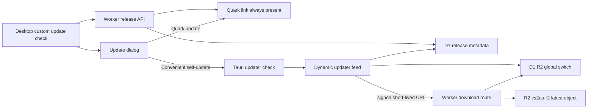

# 0.5.3 联网自更新与官网 R2 双渠道发布交接方案

## 1. 交接角色与任务边界

本文交给下一位“实际执行 AI”。执行 AI 不依赖此前聊天，必须先复核本文中的时间敏感状态，再直接完成代码、迁移、构建、官网部署和验证。

本轮方案 AI 只调查并写方案，没有修改业务代码、没有执行 D1 迁移、没有上传 R2、没有部署官网、没有构建或发布安装程序。

任务涉及两个仓库：

- 桌面端：`E:\CS2AS05`
- 官网：`E:\cs2as`
- 生产域名：`https://cs2as.600318.xyz`
- D1：`cs2asd1`，binding 为 `DB`
- 用户已创建的 R2 bucket：`cs2as-r2`

不要新建分支。不要回退、覆盖或清理两个仓库已有的修改与未跟踪文件。允许把本次实现和已有改动一起发布，但必须先记录 `git status --short --branch`。

## 2. 完成定义

以下全部成立才算完成：

1. 有新版本时，桌面端同一更新提示中同时提供“便捷自更新”和“使用夸克更新”。
2. 用户点击便捷自更新后，程序使用 Tauri updater 下载并展示真实字节进度；不得用浏览器下载模拟自更新。`tauri-plugin-updater 2.10.1` 会把已验证安装包保存在当前程序进程的资源表中，不要把它误报成已持久化到磁盘下载目录。
3. 下载完成后再次询问“安装并重启”或“稍后安装”；未经确认不得安装。选择“稍后安装”后，同一次程序运行中必须有明确的“安装已下载版本”入口，退出程序后则只保留提醒，下次由用户确认后重新下载。
4. 用户确认后由 Tauri 官方 updater 校验签名并安装，随后尝试重启。若 Windows 安装器接管进程导致无法执行显式重启，允许安装完成后退出，但必须诚实提示。
5. 夸克链接始终保留，R2 被关闭、缺文件、下载失败、签名失败时都能继续使用夸克。
6. 官网隐藏后台 `/mm-259` 有仅站长可操作的 R2 推送总开关，开关状态来自服务端 D1，并由 Worker 在 feed 和下载两个入口强制执行。
7. `cs2as-r2` 只保留当前最新正式版安装包；上传新版本成功并切换权威元数据后才删除旧对象。
8. R2 对象不直接公开。桌面端只通过 Worker 的受控下载路由取文件，关闭开关后新 feed 返回 204，新的下载请求也被拒绝。
9. 官网迁移、Worker、后台 UI 部署到生产，生产 API、管理权限、R2 开关、下载和夸克回退均验证通过。
10. 桌面端单元测试、类型检查、lint、Web build、Rust tests、签名 NSIS bundle 全部通过，并把安装包、`.sig`、SHA256、大小和证据路径交付给用户。

## 3. 2026-07-26 调查基线

### 3.1 桌面端现状

- 当前分支：`main`。
- `package.json`、`src-tauri/Cargo.toml`、`src-tauri/tauri.conf.json` 均为 `0.5.3`。
- Git 最新提交包含 `Release 0.5.3...`，但线上 D1 最新仍为 `0.5.2`，说明 `0.5.3` 尚未成为官网公开版本。
- 当前更新检查入口：`src/services/software-updates.ts`。
- 当前状态控制：`src/features/software-updates/state.ts`。
- 当前弹窗：`src/components/SoftwareUpdateModal.vue`。
- 当前触发入口：`src/components/SupportActions.vue`。
- 当前下载行为：`src-tauri/src/services/support.rs` 只允许并调用系统浏览器打开 `pan.quark.cn` 或官网链接。
- 当前 API：`GET /api/software-updates/cs2-bot-improver?currentVersion=<version>&channel=prod`。
- 已配置 `src-tauri/tauri.prod.json` 的 `createUpdaterArtifacts: true`，但普通 `npm run bundle:desktop` 只执行 `tauri build`，未加载该文件。
- 尚未安装 `@tauri-apps/plugin-updater`、`@tauri-apps/plugin-process`、`tauri-plugin-updater`、`tauri-plugin-process`。
- `src-tauri/capabilities/default.json` 尚无 updater/process 权限。
- `tauri.conf.json` 尚无 updater `pubkey`、`endpoints` 和 Windows `installMode`。
- 当前环境没有 `TAURI_SIGNING_PRIVATE_KEY` 和 `TAURI_SIGNING_PRIVATE_KEY_PASSWORD`，仓库内也没有可用签名密钥。
- 2026-07-26 查询到插件版本：updater `2.10.1`，process `2.3.1`。执行时仍应以与当前 Tauri 2.x 兼容的最新小版本为准，更新 lockfile 后跑完整测试。

桌面端已有改动包括 README、多个 Vue/CSS 文件、技术动效文档、截图和测试。全部保留；自更新实现必须增量叠加。

### 3.2 官网现状

- 当前分支：`codex/all-command-library`，不要切换或新建分支。
- `src/worker.ts` 和 `src/pages/ReleasePage.vue` 有未提交用户改动；`docs/`、`release-evidence/` 为未跟踪目录。全部保留。
- `wrangler.jsonc` 当前只有 `ASSETS` 与 D1 `DB`，没有 R2 binding。
- Worker 的 `Env` 只有 `DB`、`ASSETS`、`OWNER_BOOTSTRAP_TOKEN`。
- `software_releases` 只有夸克下载字段，没有 updater artifact 字段。
- 已有管理员更新记录 CRUD；管理员可保存，站长可删除。
- 线上 `GET /api/software-updates/...` 与 OPTIONS 正常，CORS 为 `*`。
- 线上最新正式记录是 `0.5.2`，夸克地址为 `https://pan.quark.cn/s/044e1498017d`。
- 当前 `0.5.3` 请求得到 `hasUpdate=false`，这是因为线上 latest 为 `0.5.2`，不是 API 故障。
- 当前 Wrangler 为 `4.111.0`，登录身份可操作 Worker/D1；`r2 bucket list` 没列出 bucket，也没有明确报错。执行前必须确认 `cs2as-r2` 与当前账号一致且当前 token 有 R2 权限，不能仅凭用户口述直接部署 binding。

### 3.3 引导版本限制

现有 `0.5.2` 客户端没有 updater 插件，因此无法突然获得应用内自更新。建议把当前尚未公开的 `0.5.3` 作为引导版本：

- `0.5.2 -> 0.5.3`：仍通过现有更新提示打开夸克手动安装。
- 已安装 `0.5.3` 的用户：从下一个更高 SemVer 开始可使用便捷自更新。

不要宣称所有旧版都能一键自更新。若执行时 `0.5.3` 已公开，则把功能版本提升到下一个 SemVer，不能同版本覆盖。

## 4. 已选架构



关键原则：

- 继续使用现有 custom release API 决定是否弹窗、展示版本说明和夸克渠道。
- 使用 Tauri v2 官方 updater 完成实际下载、签名校验和安装，不自行实现 EXE 下载执行器。
- updater 使用 dynamic update server。无更新、R2 总开关关闭或当前 release 未就绪时返回 HTTP 204。
- R2 bucket 不开公共访问。下载必须经过 Worker，并在请求开始时再次检查总开关、latest release 和短期签名 URL。
- D1 是发布状态权威面，R2 只是对象存储；不能用“R2 已有文件”替代 D1/API 验证。

## 5. 官网数据模型

新增且只新增下一号迁移，例如 `E:\cs2as\migrations\0007_software_self_update.sql`。不要修改已发布迁移。

为 `software_releases` 增加：

```sql
ALTER TABLE software_releases ADD COLUMN updater_enabled INTEGER NOT NULL DEFAULT 0;
ALTER TABLE software_releases ADD COLUMN updater_target TEXT NOT NULL DEFAULT 'windows';
ALTER TABLE software_releases ADD COLUMN updater_arch TEXT NOT NULL DEFAULT 'x86_64';
ALTER TABLE software_releases ADD COLUMN updater_r2_key TEXT;
ALTER TABLE software_releases ADD COLUMN updater_signature TEXT;
ALTER TABLE software_releases ADD COLUMN updater_sha256 TEXT;
ALTER TABLE software_releases ADD COLUMN updater_size INTEGER;
```

新增全局开关表：

```sql
CREATE TABLE IF NOT EXISTS software_update_settings (
  project_id TEXT NOT NULL,
  channel TEXT NOT NULL,
  r2_push_enabled INTEGER NOT NULL DEFAULT 0 CHECK (r2_push_enabled IN (0, 1)),
  updated_by_user_id TEXT,
  created_at TEXT NOT NULL,
  updated_at TEXT NOT NULL,
  PRIMARY KEY (project_id, channel),
  FOREIGN KEY (updated_by_user_id) REFERENCES users(id) ON DELETE SET NULL
);
```

迁移默认插入 `cs2-bot-improver/prod` 且 `r2_push_enabled=0`。默认关闭是安全发布门槛；只有对象、签名、API 和下载均验证后才由站长开启。

`updater_enabled` 是单 release 就绪开关，防止只填了一半 artifact 元数据就被推送；全局 `r2_push_enabled` 是官方服务费用与运营状态的止损开关。实际可用条件必须同时满足：

```text
global switch on
AND latest active release.updater_enabled = 1
AND target/arch match
AND r2 key/signature/sha256/size complete
AND R2 object exists
```

## 6. 官网 Worker 与配置

### 6.1 R2 binding

在实际生产 `E:\cs2as\wrangler.jsonc` 和公开模板 `wrangler.example.jsonc` 增加：

```json
"r2_buckets": [
  {
    "binding": "SOFTWARE_RELEASES",
    "bucket_name": "cs2as-r2"
  }
]
```

在 `Env` 增加 `SOFTWARE_RELEASES: R2Bucket` 与 `UPDATE_DOWNLOAD_HMAC_SECRET?: string`。先用 `npx wrangler whoami` 和 `npx wrangler r2 bucket list` 验证账号/权限；若没有 R2 权限，停止部署并先修复 token 权限。当前 Wrangler `4.111.0` 没有 `r2 object list` 子命令，对象 inventory 必须通过 Cloudflare Dashboard、Cloudflare R2 API，或发布脚本中使用受控凭据调用 R2 list 获取，不能在报告里伪造一个不存在的 Wrangler 命令。

使用 `npx wrangler secret put UPDATE_DOWNLOAD_HMAC_SECRET` 写入至少 32 随机字节的生产密钥。不要把密钥、Tauri 私钥或密码写入源码、D1、日志、证据目录或最终报告。

### 6.2 API 路由

保留并扩展现有路由：

1. `GET /api/software-updates/:projectId`
   - 继续返回现有 `latest/history/download`，夸克字段不变。
   - 对 `latest` 增加 `selfUpdate`：`available`、`reason`、`target`、`arch`、`size`、`sha256`。
   - `available=false` 时 reason 只能是稳定枚举，例如 `r2_disabled`、`artifact_not_ready`、`unsupported_platform`。
   - 不向此接口返回 R2 key、Tauri signature 或直链。

2. `GET /api/software-updater/:projectId/:channel/:target/:arch/:currentVersion`
   - 这是 Tauri dynamic updater endpoint。
   - 无可用更新时返回 204，且无 JSON body。
   - 有更新时返回 200：

```json
{
  "version": "0.5.4",
  "pub_date": "2026-07-26T00:00:00.000Z",
  "url": "https://cs2as.600318.xyz/api/software-updater/download/<release-id>?expires=<unix>&token=<hmac>",
  "signature": "<the literal contents of installer.exe.sig>",
  "notes": "<release summary and items>"
}
```

   - 版本必须复用并强化现有 SemVer 比较，不允许同版本重打包被当成更新。
   - `target` 只接受 `windows`，`arch` 只接受 `x86_64`；其他组合 204。
   - URL token 使用 HMAC-SHA256 覆盖 `releaseId|expires`，建议 15 分钟过期。

3. `GET|HEAD /api/software-updater/download/:releaseId`
   - 校验 token、过期时间、全局开关、release 仍为最新启用版本、release updater 字段完整。
   - 再从 `env.SOFTWARE_RELEASES.get(updater_r2_key)` 读取。
   - GET 直接流式返回 `object.body`，不得 `arrayBuffer()` 整包读入 Worker 内存。
   - 设置准确 `Content-Length`、`Content-Type: application/octet-stream`、安全的 `Content-Disposition`、`ETag`、`Cache-Control: private, no-store`。
   - HEAD 返回同样元数据但无 body。
   - 开关关闭返回 503，token 无效返回 403，对象不存在返回 404，并禁止回退到静态资产路由。

4. `GET /api/admin/software-update-settings?projectId=...&channel=prod`
   - `requireAdmin` 可读，返回开关、当前 latest artifact 状态、对象 key/size/hash、更新时间。

5. `PATCH /api/admin/software-update-settings`
   - 必须 `requireOwner`，只接受 `r2PushEnabled: boolean`。
   - 开启前服务端再次确认 latest release artifact 完整且 R2 object 存在；不满足返回 409，不能只靠前端禁用按钮。
   - 关闭应始终可执行并立即生效。

### 6.3 输入与安全约束

- R2 key 只由发布脚本生成，格式固定为 `software-updates/cs2-bot-improver/prod/<version>/<filename>`，后台表单不能输入任意 key。
- 禁止路径穿越、任意 bucket key、任意外部下载 URL、把 R2 变成开放代理。
- Tauri signature 必须保存 `.sig` 文件的文本内容，不是 `.sig` 路径或 URL。
- `updater_sha256` 必须是 64 位大写十六进制；size 必须为正整数，并与 R2 HEAD 一致。
- 公共 updater/feed/download 路由不得暴露管理员身份、私钥、HMAC secret 或内部异常堆栈。
- 开关状态不可只缓存在 Worker isolate；每次 feed/download 从 D1 读取，确保关闭可控。

## 7. 官网后台 UI

修改 `src/lib/api.ts`、`src/pages/AdminPage.vue` 和现有样式，在“软件更新 / 下载链接”区顶部增加一个未嵌套卡片的紧凑控制行：

- 状态：`R2 便捷自更新：已开启/已关闭`
- 次要信息：当前 latest 版本、对象是否就绪、文件大小、SHA256 缩写、最后更新时间。
- 使用现有 `ToggleSwitch` 或语义等价的 checkbox/switch；不要用文字圆角按钮假装开关。
- 只对 `owner` 显示可操作开关；`admin` 只能查看状态。
- 关闭时弹应用内确认对话框，不得使用 `window.confirm`；确认文案说明“关闭后，新请求将改用夸克更新，正在进行的下载不保证能中止”。
- 开启时若 artifact 不完整，展示服务端 409 原因和明确下一步，不得乐观切换 UI。
- 成功/失败使用页面内状态或现有 toast，不使用 `alert/prompt/confirm`。
- 保持现有后台密度、颜色、8px 以内圆角、键盘 focus、窄屏换行和深浅主题，不引入新的单色主题或大卡片。

固定用户文案至少包含：

```text
官网直连自更新产生的服务费用全部由我们官方承担，不会向用户收费。我们会使用赞助资金维持这项服务，并且只保留、推送最新版本。赞助资金用尽，或因运营、安全、维护等情况需要暂停时，我们会关闭官网直连自更新；用户仍可使用我们提供的夸克链接更新。
```

后台开关旁的管理说明必须写清楚：关闭的是“官网直连自更新”，不会删除或停用夸克链接，也不会把已经发生的服务费用转嫁给用户。

## 8. 桌面端实现

### 8.1 依赖、初始化与配置

使用官方命令或等价依赖修改：

```powershell
Set-Location E:\CS2AS05
npm install @tauri-apps/plugin-updater@^2.10.1 @tauri-apps/plugin-process@^2.3.1
Set-Location src-tauri
cargo add tauri-plugin-updater@2.10.1
cargo add tauri-plugin-process@2.3.1
```

执行时若 Tauri 2.x 插件已有更新，保持 npm 与 Cargo 同一兼容代际，不盲目跨 major。

在 `src-tauri/src/lib.rs` 初始化 updater 与 process plugin。在 `src-tauri/capabilities/default.json` 增加最小权限：

```json
"updater:default",
"process:allow-restart"
```

不要授予 shell 任意执行权限。

把 `createUpdaterArtifacts: true` 放进实际构建会读取的配置。推荐直接合并到 `tauri.conf.json`，并在同一文件配置：

```json
"plugins": {
  "updater": {
    "pubkey": "<PUBLIC KEY CONTENT>",
    "endpoints": [
      "https://cs2as.600318.xyz/api/software-updater/cs2-bot-improver/prod/{{target}}/{{arch}}/{{current_version}}"
    ],
    "windows": {
      "installMode": "passive"
    }
  }
}
```

如果保留 `tauri.prod.json`，必须把 release script 改成显式 `tauri build --config src-tauri/tauri.prod.json` 并用测试证明合并后有 updater 配置。不能继续让一个无人读取的配置制造“已启用”假象。

### 8.2 签名密钥

运行 `npx tauri signer generate -w <private-key-path>` 或当前官方等价命令生成 Tauri updater keypair。当前 `package.json` 没有 `tauri` script，不要照抄依赖该 script 的 `npm run tauri ...` 示例：

- 公钥内容写入 `tauri.conf.json`，可以提交。
- 私钥保存在仓库外，例如用户私有发布目录；不得提交。
- 私钥密码只通过 `TAURI_SIGNING_PRIVATE_KEY_PASSWORD` 注入。
- 构建前设置 `TAURI_SIGNING_PRIVATE_KEY` 指向私钥或提供私钥内容。
- 私钥/密码缺失时 release 构建必须失败，不能发布无 `.sig` 包。
- 立即生成一份可恢复的离线备份说明；丢失私钥后已安装客户端无法信任新签名，不能临时换钥冒充连续升级。

### 8.3 类型与状态机

扩展 `SoftwareRelease`：保留 `download` 作为夸克渠道，新增 `selfUpdate`，不要把原字段改成二选一。

新增 updater service，例如：

- `src/services/tauri/software-updater.ts`
- `src/features/software-updates/updater-state.ts`

明确状态：

```text
idle -> checking -> available
available -> downloading -> downloaded
downloaded -> installing -> restarting/completed
downloaded -> deferred-current-session
deferred-current-session -> installing
app-exit(deferred-current-session) -> deferred-reminder-only
deferred-reminder-only -> checking -> available -> downloading
checking/downloading/installing -> failed
failed -> available (retry) or quark fallback
```

同一时刻只允许一个下载。组件卸载不能重复触发下载；安装期间禁用关闭和重复操作。下载进度由 `Started/Progress/Finished` 事件累计真实字节，`contentLength` 缺失时显示已下载容量而不是伪百分比。

`Update` 实例和它的 `downloadedBytes` resource 必须保存在应用级 singleton/store，不能只存在于 `SoftwareUpdateModal.vue` 的局部状态中，否则关闭弹窗就会丢失“稍后安装”能力。`tauri-plugin-updater 2.10.1` 的 JS binding 把下载结果保存为当前进程 resource；它不会在程序退出后自动持久化。因此必须采用以下可解释行为：

1. 用户点“稍后安装”后只关闭二次确认，不调用 `install()`、`relaunch()` 或 updater resource 的 `close()`。
2. `SupportActions` 的更新状态改为“vX.Y.Z 已下载，等待安装”，并显示固定主操作“安装已下载的 vX.Y.Z 并重启”。用户稍后点击即可直接进入安装确认，不重复下载。
3. 手动“检查更新”、页面切换、弹窗关闭不得覆盖当前 `downloaded` 状态或释放 resource。
4. 程序正常退出前可释放 resource；同时在 localStorage 只记录 `deferredVersion`、记录时间和“需要重新下载”标记，不保存安装包、签名、临时 URL 或 token。
5. 下次启动读到该标记后显示“上次选择稍后安装 vX.Y.Z；程序关闭后安装包不会保留，需要重新下载”，提供“重新下载并安装”和“使用夸克更新”，不得自动下载或自动安装。
6. 如果重新检查发现该版本已撤回、不再是 latest 或已有更高版本，释放旧 resource、清除旧提醒，并只展示当前最新版本。若官网直连已经关闭，直接保留夸克渠道。
7. 如果用户在同一次运行中稍后安装，安装前再请求 custom release API 确认该 release 仍为 active/latest；确认通过后使用已经下载且验签成功的 bytes 安装，不再产生一次下载流量。

调用顺序如下。`tauri-plugin-updater 2.10.1` 的 Rust 实现在 `download()` 返回前对下载字节执行 `verify_signature`，因此进入 `downloaded` 状态后可以准确提示“已通过签名检查”：

```ts
const update = await check()
await update.download(onEvent)
// 展示第二次确认，保留 update 实例
await update.install()
await relaunch()
```

不要直接使用 `downloadAndInstall()`，因为它无法满足“下载完成后再次询问是否安装”。

### 8.4 更新弹窗交互与文案

第一次弹窗展示：版本、更新说明、费用承担说明、两个渠道。

- 主按钮：带 `Download` 图标的“便捷自更新”。只有 `release.selfUpdate.available=true` 时可用。
- 次按钮：带 `ExternalLink` 图标的“使用夸克更新”。始终可用，复用现有受控外链命令。
- 普通/推荐更新保留“稍后再说”；critical 也不得跳过用户同意自动下载或安装。
- 自更新不可用时不放一个永远报错的按钮；显示短状态并保留夸克按钮。

固定费用/失败文案：

```text
官网直连自更新产生的服务费用全部由我们官方承担，不会向你收费。我们会使用赞助资金维持这项服务，并且只推送最新版本。赞助资金用尽，或因运营、安全、维护等情况需要暂停时，我们会关闭官网直连自更新；届时请使用我们提供的夸克链接更新。
```

下载中在同一弹窗展示稳定进度条、已下载/总大小和“取消”能力（仅当官方 API 支持可靠取消；否则不要伪造取消按钮）。下载失败后显示具体但不泄密的错误，并把“使用夸克更新”提升为主操作。

下载完成后出现第二个应用内确认：

```text
新版本已下载并通过签名检查。现在安装并重启程序吗？
```

按钮为“安装并重启”和“稍后安装”。选择“稍后安装”后执行以下具体 UI 行为：

- 二次确认弹窗关闭，程序继续正常运行，不执行安装、不重启、不打开浏览器。
- “更新与官网”区域立即显示“vX.Y.Z 已下载，等待安装”，主按钮变为“安装已下载版本并重启”。
- 用户在本次程序未退出前点击该按钮，再显示一次最终确认；确认后直接使用内存中的已验签资源安装，无需重新下载。
- 退出按钮或窗口关闭时，如果仍有待安装资源，显示应用内退出确认：“已下载的更新尚未安装。退出后安装包不会保留，下次需要重新下载。”操作为“返回安装”“仍然退出”。不得使用浏览器原生 `confirm`。
- 用户仍然退出后，下次启动只显示上次延后版本提醒，并让用户主动选择重新下载或夸克更新；不得声称安装包仍在，也不得静默重新下载。

官网 `/rizhi` 的最新版下载区也要有简短说明：“官网直连自更新费用由官方承担；服务暂停时请使用夸克链接。”不要只在隐藏后台展示费用归属。

安装完成后优先 `await relaunch()`。Windows `passive` installer 可能接管并关闭当前进程；将此视为允许的降级，不要在安装前显示“已重启成功”。

## 9. 发布脚本与“只保留最新版”

不要让后台浏览器上传大安装包。新增本地发布脚本，例如 `E:\cs2as\scripts\publish-self-update.mjs`，由执行 AI/维护者在受控机器运行。

脚本参数至少包括：installer、sig、project、channel、version、target、arch、Quark URL、release 文案；默认 dry-run，正式发布必须显式 `--remote`。

正式流程固定为：

1. 读取 installer 和 `.sig`，计算 SHA256、字节数，校验版本与 D1 release 版本一致。
2. 查询并保存旧 settings、旧 latest release；通过 Cloudflare Dashboard/API 或发布脚本的 R2 list 能力保存 prefix 对象清单。不要把 D1 中已引用的 key 列表冒充 bucket 的完整对象清单。
3. 上传新对象到临时 key 或最终唯一 key。
4. `wrangler r2 object get` 回读到独立临时文件并重新计算 SHA256/size；只看上传命令成功不算验证。
5. 幂等写 D1 artifact 字段，先保持 `updater_enabled=0`。
6. 本地或生产 Worker 验证 updater feed 仍为 204。
7. 原子设置该 latest release `updater_enabled=1`。
8. 由站长后台开启全局开关，或脚本调用同等受保护流程；验证 feed 200、签名内容、下载 HEAD/GET。
9. 下载生产 URL 到证据目录，核对 SHA256/size，再用 Tauri updater 测试客户端完成签名校验。
10. 只有以上全部成功后，删除 `software-updates/cs2-bot-improver/prod/` 下除当前对象外的旧对象。
11. 删除后重新 list，必须只剩当前最新对象。

不能先删旧包再上传新包。回滚需要本地保留上一版本安装包和 `.sig`；R2 只保留最新意味着回滚时可能需要重新上传旧包。

## 10. 测试要求

### 10.1 官网自动化

为 Worker 逻辑补测试；若仓库当前无测试框架，至少建立轻量 Vitest/Miniflare 测试，不要只靠人工请求。

必测：

- 全局关 + artifact ready：custom API 保留夸克，`selfUpdate.available=false`；updater feed 204；download 503。
- 全局开 + artifact not ready：后台开启返回 409；feed 204。
- 全局开 + ready + 客户端旧版本：feed 200，JSON 符合 Tauri dynamic schema。
- 客户端等于/高于 latest：feed 204。
- target/arch 不支持：204。
- token 篡改/过期：403。
- release 不再是 latest：旧下载 URL 拒绝。
- GET 流式内容、HEAD、size/hash/content headers 正确。
- admin 不能改开关，owner 能改；匿名 401。
- existing software update API、CORS/OPTIONS、静态页面路由不回归。

### 10.2 桌面端自动化

扩展现有 `software-updates.spec.ts` 和 `software-update-modal.spec.ts`，新增 updater state/service 测试：

- 同一弹窗同时显示自更新和夸克。
- R2 off 只剩夸克可操作。
- 未确认不下载；下载完未确认不安装。
- 选择稍后安装后，弹窗关闭但应用级 store 仍持有 Update resource，更新区出现“安装已下载版本并重启”。
- 同一次运行稍后安装不重复下载；安装前 release 已撤回或被更高版本替代时不得安装旧 resource。
- 有待安装资源时退出确认文案与两个操作正确，使用应用内 dialog 而不是原生 confirm。
- 退出再启动只恢复 `deferredVersion` 提醒，不伪造已下载状态；必须由用户确认后重新下载。
- Started/Progress/Finished 正确累计，不因重复事件越界。
- 下载、签名、安装失败均能回到夸克。
- 防重复点击、关闭规则、normal/recommended/critical 行为。
- 第二次确认后调用顺序严格为 install 后 relaunch。
- 不显示乐观“安装成功/重启成功”。

执行：

```powershell
Set-Location E:\CS2AS05
npm run verify
Set-Location src-tauri
cargo test
Set-Location ..
npm run bundle:desktop
npm run release:manifest
```

签名发布构建还要断言 NSIS 目录同时存在 installer 与同名 `.sig`，并记录 SHA256/size。由于真实安装会影响当前程序，最终安装/重启效果由用户在 Windows 实机确认；执行 AI 先用测试版本完成非破坏性 feed/download/signature 验证。

## 11. 官网部署顺序与次数限制

官网最多部署 3 次，推荐只部署 1 次：

1. 保存两个仓库 git 状态和生产 D1/R2/API 快照。
2. 本地应用迁移，执行 `npm run typecheck`、Worker tests、`npm run build`。
3. 先 apply 远程 `0007`，查询 `d1_migrations` 和新表/列确认成功。
4. `npx wrangler deploy --dry-run`。
5. 正式 `npm run deploy` 一次。
6. 记录 deployment id/time，等待传播后验证生产。

不要为了验证开关上传真实大包多次。先用 `test` channel 和小型、签名无效的 fixture 验证路由与权限；正式包只上传一次，最终验收必须用真实签名安装包。

## 12. 生产验收矩阵

必须保存到新目录，例如：

```text
E:\cs2as\release-evidence\self-update-<version>-<timestamp>\
```

验收顺序：

1. D1 migration row、settings row、latest release artifact 字段唯一且完整。
2. R2 prefix 仅一个最新对象，size/hash 与本地安装包一致。
3. 开关关闭：custom API 有夸克、selfUpdate unavailable；Tauri feed 204；下载 URL 503。
4. 后台以 admin 登录：可见不可改；以 owner 登录：可关闭/开启；使用 Codex 内置浏览器验证，不只凭截图。
5. 开关开启：旧版本 feed 200，当前版本 feed 204，错误 target/arch 204。
6. 生产 URL 下载内容 SHA256/size 一致，过期/篡改 token 被拒绝。
7. `/rizhi` 仍显示最新版说明和夸克按钮；现有未提交的 ReleasePage 下载链接修复不能丢失。
8. `/rizhi` 与桌面更新弹窗均明确说明服务费用由官方承担，不向用户收费；赞助用尽或其他需停服情况会关闭直连，夸克继续可用。
9. 桌面端模拟 R2 off、下载失败、签名失败，均可打开同一个夸克 URL。
10. 桌面端真实下载显示进度，下载完成后停在第二次确认，不自动安装。
11. 选择稍后安装后，在同一次运行可从“更新与官网”直接安装；退出时有明确警告，重启后显示需重新下载的提醒。
12. 经用户同意后实际安装并尝试重启，启动后版本号为目标版本，再检查返回“已是最新版本”。

## 13. 回滚

### 官网代码回滚

- 只回滚本次 Worker/UI/config 变更，不碰执行前已有的 `ReleasePage.vue`、`worker.ts` 用户改动。
- Cloudflare 代码异常时部署上一份已验证 Worker；部署仍计入 3 次上限。
- `0007` 是向后兼容加列/加表，不执行破坏性 down migration。旧 Worker 会忽略新字段。

### 发布状态回滚

1. 首先将 D1 全局开关设为 0，这是最快止损。
2. 验证 updater feed 204、下载新请求 503、夸克仍可用。
3. 恢复发布前 release/settings D1 快照。
4. 若要恢复上一自更新版本，从本地保留的 installer/`.sig` 重新上传，再核对 hash/size 后启用；不能指望 R2 中仍有旧对象。
5. 只有确认新对象由本次创建且不再被 D1 引用后才删除。

### 桌面端回滚

- 未发布：回退本次 updater 文件和依赖即可，保留其他脏改动。
- 已发布且 updater 有问题：关闭官网 R2 开关，用户自动回到夸克渠道；用更高 SemVer 修复，不能同版本覆盖。
- 签名密钥错误：不要换 key 强推。恢复正确私钥重建更高版本，否则旧客户端会拒绝。

## 14. 执行 AI 最终报告

最终报告必须包含：

- 两个仓库实际修改文件和保留的既有脏改动。
- migration 名称、远程应用结果、Worker deployment id/time。
- R2 bucket/key、仅保留对象数量、installer size/SHA256；不泄露 token 或密钥。
- 开关关闭/开启的 custom API、Tauri feed、download 路由状态码差分。
- admin/owner 服务端权限验证与后台真实交互结果。
- 桌面端测试、Rust tests、bundle、`.sig` 和 release manifest 路径。
- 夸克 URL 仍可用的证据。
- `0.5.3` 是否作为引导版，以及旧用户首次仍需夸克安装的明确说明。
- 用户实机安装/重启是否已验证；未验证就写“待用户实机确认”，不能以构建成功代替。
- 证据目录绝对路径、最终 `git status --short --branch`。

不要自动提交或推送 GitHub，除非用户在执行阶段明确要求；若要求推送，最多尝试 1 次。官网正式部署最多 3 次，桌面安装程序构建最多 5 次。
