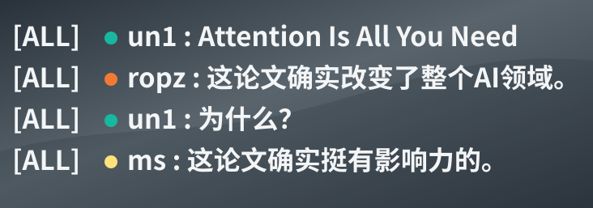

# CS2 Bot LLM Chat

让 CS2 服务器里的 bot 用自己的聊天身份接玩家一句话。



这个插件基于 **CounterStrikeSharp**，使用 OpenAI 兼容接口请求模型。当前默认配置很简单：玩家聊天后，插件会随机挑一个可用 bot 回复一句；不做复杂人设，不做长期记忆，也不让每个 bot 都单独请求模型。

比较关键的一点是：插件优先尝试让 bot 执行原生 `say`，而不是只用服务器全局通知打印一行字。这样聊天框里看到的就是 bot 自己的名字和身份在说话，效果更接近正常玩家发言。

## 特性

- 普通聊天也可以触发 bot 回复。
- 回复很短，尽量像游戏里随口接一句。
- 发言 bot 从当前在线 bot 里随机选。
- 队伍聊天会尽量让同队 bot 回复。
- 安装 BotHider 时，优先使用 BotHider 管理的 bot。
- 只带最近几句聊天作为上下文，不保存长期记忆。

## 安装要求

- CS2 服务器
- Metamod:Source
- CounterStrikeSharp
- .NET 8 SDK
- 一个 OpenAI 兼容接口的 API key，例如 DeepSeek

## 构建

```powershell
.\.dotnet\dotnet.exe restore
.\.dotnet\dotnet.exe test --no-restore
.\.dotnet\dotnet.exe publish .\src\CS2BotLlmChat\CS2BotLlmChat.csproj -c Release --no-restore
```

发布文件在：

```text
src/CS2BotLlmChat/bin/Release/net8.0/publish/
```

把里面的文件复制到：

```text
game/csgo/addons/counterstrikesharp/plugins/CS2BotLlmChat/
```

## 配置

配置文件通常在：

```text
game/csgo/addons/counterstrikesharp/configs/plugins/CS2BotLlmChat/CS2BotLlmChat.json
```

可以参考：

```text
examples/CS2BotLlmChat.example.json
```

推荐把 API key 放到环境变量：

```powershell
$env:CS2_BOT_LLM_API_KEY = "your-key"
```

配置里可以这样写：

```json
"ApiKey": "ENV:CS2_BOT_LLM_API_KEY"
```

也可以直接写到服务器本地配置里，但不要提交到仓库。

## 常用参数

当前测试配置里，未点名聊天也会 100% 尝试回复：

```json
"selection": {
  "noMentionBaseReplyChance": 1.0
}
```

测试阶段默认关闭聊天冷却：

```json
"rateLimit": {
  "globalCooldownMs": 0,
  "perBotCooldownMs": 0,
  "perPlayerCooldownMs": 0,
  "maxRepliesPerMinute": 10
}
```

如果觉得太吵，可以把 `noMentionBaseReplyChance` 降到 `0.1` 到 `0.3`，或者把冷却时间调回来。

## 游戏内命令

```text
css_llmbot_reload
```

重新加载配置。

```text
css_llmbot_test 你好
```

测试模型接口是否能正常返回。

```text
css_llmbot_saytest hello
```

测试能否让真实 bot 在聊天里发言。

```text
css_llmbot_bhstatus
```

查看 BotHider 是否可用。

```text
css_llmbot_diag
```

查看当前 bot 数量、pending 状态、冷却参数和触发概率。聊天不回复时先看这个。

## 推荐测试顺序

进服后先执行：

```text
css_llmbot_reload
css_llmbot_diag
css_llmbot_saytest test
css_llmbot_test 你能回复吗
```

然后直接发普通聊天即可。当前配置下，不需要 `@bot`。

## 注意

- 这不是多 bot 人设系统。
- 不会保存长期记忆。
- 不建议把回复频率长期保持在 100%。
- 如果刚替换了插件 DLL，通常需要重新开一次本地服务器；只改配置时执行 `css_llmbot_reload` 即可。

## 协议

本项目使用 GPL-3.0 协议。详见 [LICENSE](LICENSE)。

## 相关项目与鸣谢

详见 [CREDITS.md](CREDITS.md)。
